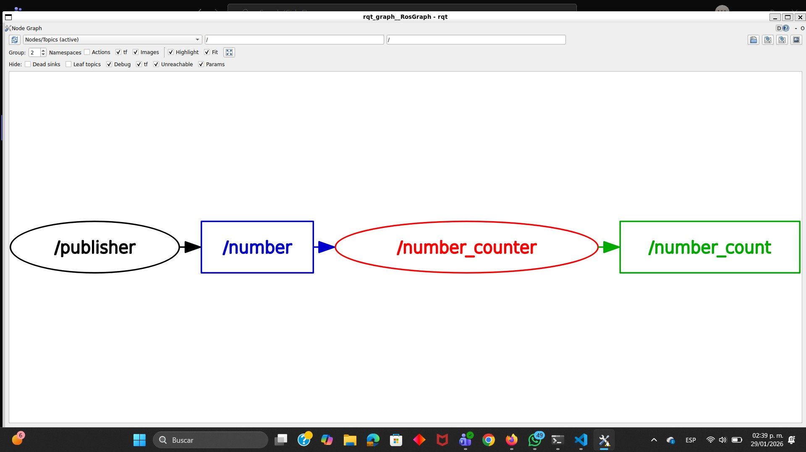

# ROS2 TOPICS

## Introduction
In this activity, I work with ROS2 topics to understand how nodes communicate through publishers and subscribers. I create two nodes from scratch: one that publishes a constant integer value, and another that subscribes to this value, processes it, and publishes an accumulated result. By the end of the activity, I visualize the node–topic graph and verify the data flow using ROS2 command-line tools.

### Publisher Code
``` codigo
#!/usr/bin/env python3

import rclpy
from rclpy.node import Node
from example_interfaces.msg import Int64


class NumberPublisher(Node):

    def __init__(self):
        super().__init__('publisher')
        self.publisher_ = self.create_publisher(Int64,'/number',10)
        self.timer = self.create_timer(1.0, self.timer_callback)
        self.number = 50
        self.get_logger().info('Publisher working...')

    def timer_callback(self):
        msg = Int64()
        msg.data = self.number
        self.publisher_.publish(msg)
        self.get_logger().info(f'Publicando: {msg.data}')

def main(args=None):
    rclpy.init(args=args)
    nodito = NumberPublisher()
    rclpy.spin(nodito)
    rclpy.shutdown()

if __name__ == '__main__':
    main()
```

The NumberPublisher node creates a publisher on the /number topic using the Int64 message type and uses a timer to send the value 50 once every second. Each time the timer callback is executed, a message is created, populated with the number, and published, while also printing a log message to confirm the data being sent. The main function initializes ROS2, runs the node, and keeps it active until it is manually stopped.


### Publisher and Suscriber Code
``` codigo
#!/usr/bin/env python3

import rclpy
from rclpy.node import Node
from example_interfaces.msg import Int64


class NumberCounter(Node):

    def __init__(self):
        super().__init__('number_counter')
        self.counter = 0
        self.subscription = self.create_subscription(
            Int64,
            '/number',
            self.listener_callback,
            10
        )
        self.publisher_ = self.create_publisher(
            Int64,
            '/number_count',
            10
        )
        self.get_logger().info('Number counter working...')

    def listener_callback(self, msg):
        self.counter += msg.data
        out_msg = Int64()
        out_msg.data = self.counter
        self.publisher_.publish(out_msg)
        self.get_logger().info(
            f'Recibido: {msg.data} | Total: {self.counter}'
        )

def main(args=None):
    rclpy.init(args=args)
    nodito = NumberCounter()
    rclpy.spin(nodito)
    rclpy.shutdown()

if __name__ == '__main__':
    main()
```

This code defines a ROS2 node that subscribes to an integer topic, processes incoming data, and publishes the accumulated result. The NumberCounter node listens to the /number topic using the Int64 message type and maintains an internal counter that increases every time a new value is received. Inside the subscriber callback, the received number is added to the counter, and the updated total is immediately published to the /number_count topic

## Conclution
Through this activity, I successfully implemented ROS2 communication using topics by creating interacting publisher and subscriber nodes. The system demonstrates how data can be generated, processed, and redistributed in real time, reinforcing the fundamental ROS2 concepts of node interaction, message passing, and callback-based execution.

