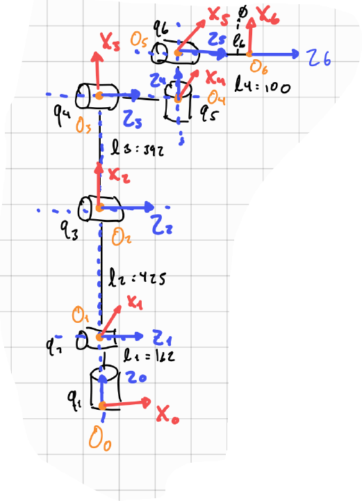

# Forward Kinematics for KUKA AN UR ROBOT

## Introduction
In this activity, the kinematic modeling of two industrial manipulators will be developed: a KUKA robot and a UR robot. The Denavit–Hartenberg (DH) convention will be used to mathematically describe the geometric relationships between links through standardized parameters.

## KUKA

### Schematic diagram

### D-H Table
| Joint      | d     | θ           | a  |  α |
|-----------:|:-----:|:-----------:|:--:|--  |
| 1          | -935  |  θ1         | 260|π/2 |
| 2          | 0     |  θ2         |-680| 0  |
| 3          | 0     |  θ3         | 0  |-π/2|
| 4          | -630  |  θ4         | 0  | π/2|
| 5          | 0     |  θ5         | 0  |-π/2|
| 6          | -135  |  θ6         | 0  | 0  |

## UR

### Schematic diagram

### D-H Table
| Joint      | d     | θ           | a  |  α |
|-----------:|:-----:|:-----------:|:--:|--  |
| 1          | 162   |  θ1 + π/2   | 0  |π/2 |
| 2          | 0     |  θ2  + π/2  |425 | 0  |
| 3          | 0     |  θ3         | 392| 0  |
| 4          | 133   |  θ4 -π/2    | 0  |-π/2|
| 5          | 100   |  θ5         | 0  | π/2|
| 6          | 42    |  θ6 + π/2   | 0  | 0  |