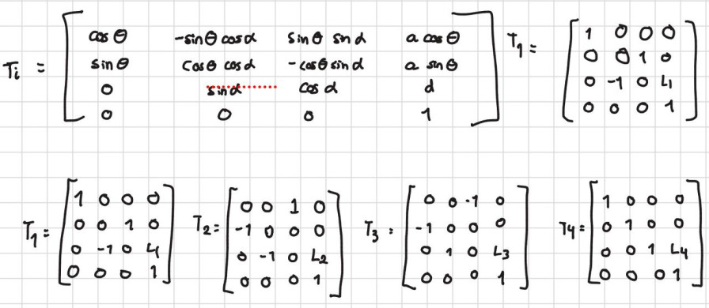
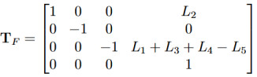

# Forward Kinematics

## Introduction
Robotics kinematics studies robot motion without considering the forces involved, focusing on the position and orientation of its links. Forward kinematics computes the end-effector position and orientation from the joint variables. The robot is modeled as a kinematic chain of links and joints, using reference frames to describe spatial relationships. The Denavit–Hartenberg convention standardizes this representation using four parameters, simplifying the kinematic analysis of robotic manipulators.

## Exercices

### Exercise 1

| Joint | θ | d        | | a        | | α        |
|-----------:|:-----:|-------------|
|1| 2     | 0         | 0    | +90°  |
| 2      | d2     | L1    |0°   |

### Exercise 2

### Exercise 3

### Exercise 4

