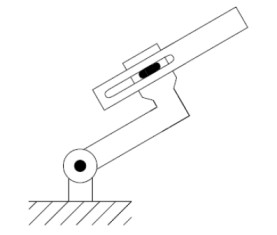
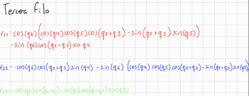

# Forward Kinematics

## Introduction
Robotics kinematics studies robot motion without considering the forces involved, focusing on the position and orientation of its links. Forward kinematics computes the end-effector position and orientation from the joint variables. The robot is modeled as a kinematic chain of links and joints, using reference frames to describe spatial relationships. The Denavit–Hartenberg convention standardizes this representation using four parameters, simplifying the kinematic analysis of robotic manipulators.

## Exercices

### Exercise 1



### Exercise 2


### Exercise 3


### Exercise 4


### Final Transformation Matrix

```
T06 = [
 r11 r12 r13 px
 r21 r22 r23 py
 r31 r32 r33 pz
 0   0   0   1
]
```

---

### Rotation Terms

```
r11 = c1*c23*c4*s5 + c1*s23*c5 - s1*s4*s5

r12 = c6*(c1*c23*s4 + s1*c4)
      - s6*(c1*c23*c4*c5 - c1*s23*s5 - s1*s4*c5)

r13 = s6*(c1*c23*s4 + s1*c4)
      + c6*(c1*c23*c4*c5 - c1*s23*s5 - s1*s4*c5)

r21 = s1*c23*c4*s5 + s1*s23*c5 + c1*s4*s5

r22 = c6*(s1*c23*s4 - c1*c4)
      - s6*(s1*c23*c4*c5 - s1*s23*s5 + c1*s4*c5)

r23 = s6*(s1*c23*s4 - c1*c4)
      + c6*(s1*c23*c4*c5 - s1*s23*s5 + c1*s4*c5)

r31 = s23*c4*s5 - c23*c5

r32 = c6*s23*s4
      - s6*(s23*c4*c5 + c23*s5)

r33 = s6*s23*s4
      + c6*(s23*c4*c5 + c23*s5)
```

---

### Position Terms

```
px = c1*(8*c2 + 8*c23 - d4*s23) - d3*s1

py = s1*(8*c2 + 8*c23 - d4*s23) + d3*c1

pz = 13 + 8*s2 + 8*s23 + d4*c23 + d6
```

---

### Exercise 5


