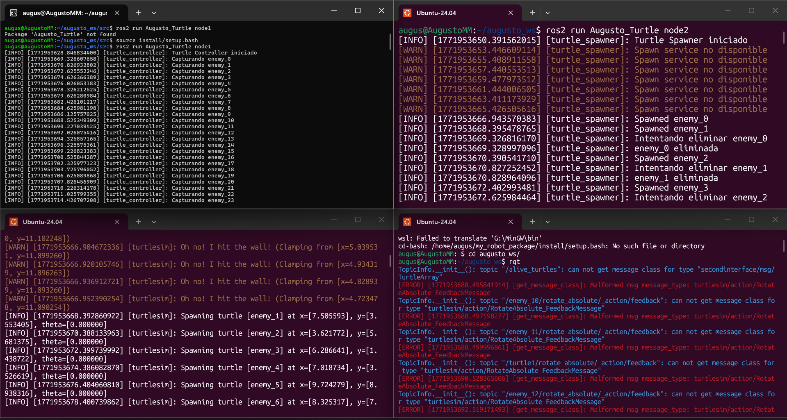
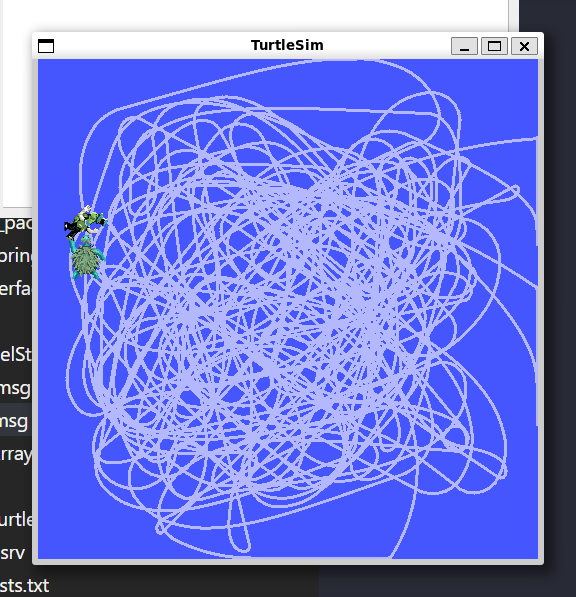
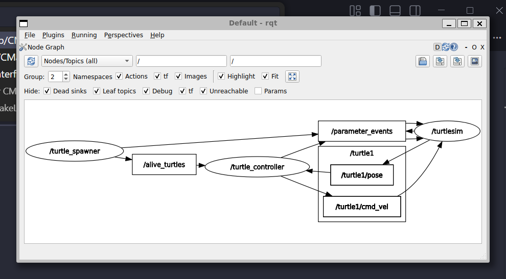

# Ros Basics Capstone

## Introduction
In this practice, a distributed system was developed in ROS 2 using the Turtlesim simulator, aiming to implement communication between nodes through topics, services, and custom interfaces. A turtle spawner node was designed to generate dynamic targets within the environment and publish their state, while a controller node was implemented to pursue them using proportional control based on the robot’s position and orientation. Additionally, a custom service was created to remove turtles once they were reached, integrating both synchronous and asynchronous communication within the same architecture.

## Codes
Before proceeding with the code implementation, it was necessary to properly structure the package by creating the msg and srv directories, which are used for defining custom interfaces.

Within the msg directory, the files Turtle.msg and TurtleArray.msg were defined to represent the information of an individual turtle and a collection of active turtles in the environment, respectively.

Turtle.msg:
``` codigo
string name
float32 x
float32 y
float32 theta
```

TurtleArray.msg:
``` codigo
Turtle[] turtles
```

Similarly, within the srv directory, the file CatchTurtle.srv was created to define the service responsible for handling the capture and removal of turtles within the system.

CatchTurtle.srv:
``` codigo
string name
---
bool success
```
Once the custom interfaces were defined, the implementation of the main system nodes was carried out: the Controller node and the Spawner node.

The Controller node was designed to manage the motion of the main turtle, compute positional and angular errors with respect to the target, and execute the capture logic through a custom service. Meanwhile, the Spawner node is responsible for dynamically generating new turtles within the environment, maintaining an updated list of active targets, and managing their removal once they are reached.

The corresponding source code for both nodes is presented below.

### Controller code
``` codigo
#!/usr/bin/env python3
import rclpy
from rclpy.node import Node
import math
import numpy as np
from geometry_msgs.msg import Twist
from turtlesim.msg import Pose
from secondinterface.msg import TurtleArray
from secondinterface.srv import CatchTurtle


class TurtleController(Node):
    def __init__(self):
        super().__init__('turtle_controller')
        self.pose_subscriber = self.create_subscription(Pose,'/turtle1/pose',self.pose_callback,10)
        self.alive_subscriber = self.create_subscription(TurtleArray,'/alive_turtles',self.alive_callback,10)
        self.cmd_publisher = self.create_publisher(Twist,'/turtle1/cmd_vel',10)
        self.catch_client = self.create_client(CatchTurtle,'/catch_turtle')

        self.current_pose = None
        self.target_turtle = None
        self.Kp_d = 1.5
        self.Kp_theta = 6.0
        self.timer = self.create_timer(0.1, self.control_loop)
        self.get_logger().info("Turtle Controller iniciado")

    def pose_callback(self, msg):
        self.current_pose = msg

    def alive_callback(self, msg):
        if len(msg.turtles) > 0:
            self.target_turtle = msg.turtles[0]
        else:
            self.target_turtle = None

    def control_loop(self):
        if self.current_pose is None:
            return

        if self.target_turtle is None:
            return

        dx = self.target_turtle.x - self.current_pose.x
        dy = self.target_turtle.y - self.current_pose.y
        distance = math.sqrt(dx**2 + dy**2)

        theta_target = math.atan2(dy, dx)
        angle_error = theta_target - self.current_pose.theta
        angle_error = (angle_error + np.pi) % (2 * np.pi) - np.pi

        cmd = Twist()

        if distance < 0.3:
            if self.catch_client.wait_for_service(timeout_sec=1.0):
                request = CatchTurtle.Request()
                request.name = self.target_turtle.name
                self.catch_client.call_async(request)

                self.get_logger().info(f"Capturando {self.target_turtle.name}")
                self.target_turtle = None

            cmd.linear.x = 0.0
            cmd.angular.z = 0.0

        else:
            cmd.linear.x = self.Kp_d * distance
            cmd.angular.z = self.Kp_theta * angle_error

        self.cmd_publisher.publish(cmd)


def main(args=None):
    rclpy.init(args=args)
    node = TurtleController()
    rclpy.spin(node)
    rclpy.shutdown()

if __name__ == '__main__':
    main()
```

### Spawner code
``` codigo
#!/usr/bin/env python3
import rclpy
from rclpy.node import Node
import random
from turtlesim.srv import Spawn
from turtlesim.srv import Kill
from secondinterface.msg import Turtle
from secondinterface.msg import TurtleArray
from secondinterface.srv import CatchTurtle


class TurtleSpawner(Node):
    def __init__(self):
        super().__init__('turtle_spawner')
        self.spawn_client = self.create_client(Spawn, '/spawn')
        self.kill_client = self.create_client(Kill, '/kill')
        self.catch_service = self.create_service(CatchTurtle,'/catch_turtle',self.catch_callback)
        self.alive_publisher = self.create_publisher(TurtleArray,'/alive_turtles',10)

        self.alive_turtles = []
        self.turtle_counter = 0
        self.spawn_timer = self.create_timer(2.0, self.spawn_turtle)
        self.get_logger().info("Turtle Spawner iniciado")

    def spawn_turtle(self):
        if not self.spawn_client.wait_for_service(timeout_sec=1.0):
            self.get_logger().warning("Spawn service no disponible")
            return

        x = random.uniform(1.0, 10.0)
        y = random.uniform(1.0, 10.0)
        request = Spawn.Request()
        request.x = x
        request.y = y
        request.theta = 0.0
        request.name = f"enemy_{self.turtle_counter}"

        future = self.spawn_client.call_async(request)
        future.add_done_callback(lambda future: self.spawn_callback(future, x, y))
        self.turtle_counter += 1

    def spawn_callback(self, future, x, y):
        try:
            response = future.result()
        except Exception as e:
            self.get_logger().error(f"Error en spawn: {e}")
            return

        new_turtle = Turtle()
        new_turtle.x = x
        new_turtle.y = y
        new_turtle.theta = 0.0
        new_turtle.name = response.name

        self.alive_turtles.append(new_turtle)
        self.publish_alive_turtles()
        self.get_logger().info(f"Spawned {response.name}")

    def publish_alive_turtles(self):
        msg = TurtleArray()
        msg.turtles = self.alive_turtles
        self.alive_publisher.publish(msg)


    def catch_callback(self, request, response):
        turtle_name = request.name
        self.get_logger().info(f"Intentando eliminar {turtle_name}")

        if not self.kill_client.wait_for_service(timeout_sec=1.0):
            self.get_logger().warning("Kill service no disponible")
            response.success = False
            return response

        kill_request = Kill.Request()
        kill_request.name = turtle_name

        self.kill_client.call_async(kill_request)
        self.alive_turtles = [
            turtle for turtle in self.alive_turtles
            if turtle.name != turtle_name
        ]
        self.publish_alive_turtles()
        self.get_logger().info(f"{turtle_name} eliminada")
        response.success = True
        return response


def main(args=None):
    rclpy.init(args=args)
    node = TurtleSpawner()
    rclpy.spin(node)
    rclpy.shutdown()

if __name__ == '__main__':
    main()
```

## Results




## Conclusion
In this practice, a distributed system was successfully implemented in ROS 2, integrating communication through topics, services, and custom interfaces within the Turtlesim environment. The developed architecture enabled the dynamic coordination of target generation, tracking, and removal through a client-server scheme combined with proportional control for robot motion.