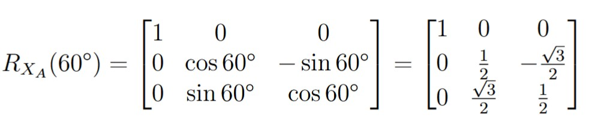
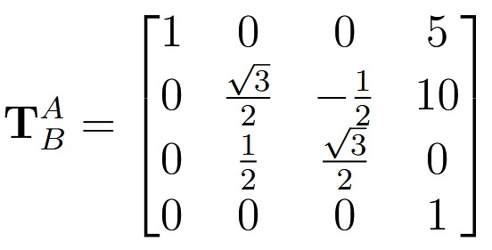
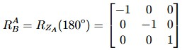

## Exercise 1

A vector **P** is rotated about the axis **Ya** by an angle of 45°, and then rotated about the axis **Xa** by an angle of 60°. Give the rotation matrix that performs these rotations in the indicated order.

Solving for the rotations of the Ya axis we will have the following matrix:

And for the Xa axis rotation we got this matrix:

Since the rotation around the Ya​ axis occurs first, the total rotation matrix is given by:

Carrying out the matrix multiplication, we obtain:

## Exercise 2

Reference frame B is rotated with respect to reference frame A by an angle of 30° about the axis Xa. The translation of frame B with respect to frame A is given by [5 10 0] formulate the homogeneous transformation matrix

The rotation of frame B with respect to frame A about the XA axis is expressed as:

The translation of frame B relative to frame A is given by:

The homogeneous transformation matrix TAB is constructed as:
C

Substituting the corresponding terms:

## Exercise 3

- From the given image, obtain:
    * The value of ABT
    * The value of ACT

From the diagram, the origin of frame B is displaced from the origin of frame A by a distance of 3 units along the Xa axis. Therefore, the translation vector is:

Looking at the image the orientation of the axes corresponds to a rotation of 180◦ about the Za axis:

So, the homogeneous transformation matrix Tab is this:

The origin of frame C is obtained by moving 3 units along the XA axis and 2 units along the ZA axis:

From the diagram, frame C is rotated by 30◦ about the ZA axis with respect to frame A. The rotation matrix is given by:

So, the homogeneous transformation matrix Tab is this:
